# Screen Flow Overview

## Project Info
- **Project Name**: SAA 2025 (Sun* Awards)
- **Figma File Key**: 9ypp4enmFmdK3YAFJLIu6C
- **Figma URL**: https://momorph.ai/files/9ypp4enmFmdK3YAFJLIu6C
- **Created**: 2026-05-06
- **Last Updated**: 2026-05-14

---

## Discovery Progress

| Metric | Count |
|--------|-------|
| Total Screens (in file) | 100+ (most are atomic component frames) |
| Discovered (full screens) | 4 |
| Remaining | Many — see Next Steps |
| Completion | n/a (multi-run) |

> Note: Each run processes ONE screen at a time per the operating principle. Discovered = Login + Homepage SAA + Countdown - Prelaunch page + Hệ thống giải (Awards Information) + Sun* Kudos - Live board + Viết Kudo.

---

## Screens

| # | Screen Name | Frame ID | Figma Link | Status | Detail File | Predicted APIs | Navigations To |
|---|-------------|----------|------------|--------|-------------|----------------|----------------|
| 1 | Login | GzbNeVGJHz | https://momorph.ai/files/9ypp4enmFmdK3YAFJLIu6C/screens/GzbNeVGJHz | discovered | screen_specs/login.md | `GET /auth/session`, `GET /auth/google`, `GET /auth/google/callback`, `GET /i18n/locales` | Homepage SAA (success), Language Dropdown |
| 2 | Homepage SAA | i87tDx10uM | https://momorph.ai/files/9ypp4enmFmdK3YAFJLIu6C/screens/i87tDx10uM | discovered | screen_specs/homepage-saa.md | `GET /auth/session`, `GET /users/me`, `GET /campaign/current`, `GET /awards`, `GET /notifications/unread-count`, `GET /kudos/feed`, `GET /i18n/locales`, `POST /auth/logout` | Award Information (TBD), Sun* Kudos - Live board, Language Dropdown, Notification panel, Dropdown-profile (+ Admin), Viết Kudo, Thể lệ, Tiêu chuẩn cộng đồng, six Award detail screens |
| 3 | Countdown - Prelaunch page | 8PJQswPZmU | https://momorph.ai/files/9ypp4enmFmdK3YAFJLIu6C/screens/8PJQswPZmU | discovered | screen_specs/countdown-prelaunch-page.md | `GET /campaign/current`, `GET /server/time` (optional), `GET /auth/session` (on unlock) | Login (countdown→0, no session), Homepage SAA (countdown→0, has session) |
| 4 | Hệ thống giải (Awards Information) | zFYDgyj_pD | https://momorph.ai/files/9ypp4enmFmdK3YAFJLIu6C/screens/zFYDgyj_pD | discovered | screen_specs/he-thong-giai.md | `GET /auth/session`, `GET /users/me`, `GET /campaign/current`, `GET /awards`, `GET /notifications/unread-count`, `GET /i18n/locales` | Homepage SAA (header logo / "About SAA 2025" / footer), Sun* Kudos - Live board (header / footer / promo), Language Dropdown, Notification panel, Dropdown-profile (+Admin), Tiêu chuẩn cộng đồng (footer), self anchors `#top-talent` / `#top-project` / `#top-project-leader` / `#best-manager` / `#signature-2025-creator` / `#mvp` |
| 5 | Sun* Kudos - Live board | MaZUn5xHXZ | https://momorph.ai/files/9ypp4enmFmdK3YAFJLIu6C/screens/MaZUn5xHXZ | discovered | specs/MaZUn5xHXZ-Sun-Kudos-Live-board/spec.md | `GET /auth/session`, `GET /users/me`, `GET /kudos/highlight`, `GET /kudos/feed`, `GET /kudos/spotlight`, `POST /kudos`, `POST /kudos/:id/heart`, `GET /hashtags`, `GET /departments`, `GET /leaderboards/recent-gifts`, `GET /leaderboards/rank-ups`, `POST /secret-boxes/open`, `GET /notifications/unread-count` | Login (unauthenticated), Profile page (avatar / name clicks — route TBD), Kudos detail (card / "Xem chi tiết" / Spotlight node — route TBD), Send-Kudos dialog (A.1 pill), Secret-Box dialog (D.1.8 "Mở quà"), Hashtag dropdown (B.1.1), Phòng ban dropdown (B.1.2), Image lightbox (C.3.6 thumbnails), Homepage SAA (header logo / footer), Hệ thống giải (header / footer), Language Dropdown, Notification panel, Dropdown-profile (+Admin) |
| 6 | Viết Kudo | ihQ26W78P2 | https://momorph.ai/files/9ypp4enmFmdK3YAFJLIu6C/screens/ihQ26W78P2 | discovered | specs/ihQ26W78P2-Viet-Kudo/spec.md | `GET /auth/session`, `GET /kudos/sunners` (autocomplete + mention), `GET /kudos/hashtags`, `POST /kudos` (extended with `isAnonymous` + `anonymousAlias`), `POST /kudos/uploads` (predicted multipart image upload) | Login (unauthenticated), Sun* Kudos - Live board (on successful send / Hủy / Esc — modal/dialog parent), Sunner profile (mention `@name` → `/sunner/[id]`), Homepage SAA (header logo / footer chrome) |

---

## Navigation Graph

```mermaid
flowchart TD
    subgraph Gate["Pre-launch Gate"]
        Countdown["Countdown - Prelaunch page (8PJQswPZmU)"]
    end

    subgraph Auth["Authentication"]
        Login["Login (GzbNeVGJHz)"]
    end

    subgraph Main["Main Application"]
        Home["Homepage SAA (i87tDx10uM)"]
        AwardInfo["Hệ thống giải / Awards Information (zFYDgyj_pD)"]
        Kudos["Sun* Kudos - Live board (MaZUn5xHXZ)"]
        ViếtKudo["Viết Kudo (ihQ26W78P2)"]
        Theol["Thể lệ UPDATE (b1Filzi9i6)"]
        TCC["Tiêu chuẩn cộng đồng (Dpn7C89--r)"]
        Notif["Notification panel (TBD: 6-1LRz3vqr / gWBVcaSVIf)"]
    end

    subgraph Overlays["Overlays / Dropdowns"]
        Lang["Language Dropdown (IiLVGkACbt)"]
        ProfileDD["Dropdown-profile (z4sCl3_Qtk)"]
        AdminProfileDD["Dropdown-profile Admin (54rekaCHG1)"]
    end

    subgraph Errors["Error Pages"]
        E403["Error page - 403 (T3e_iS9PCL)"]
    end

    %% Pre-launch gate edges
    Login -- "now < campaign.start_at (auto)" --> Countdown
    Home -- "now < campaign.start_at (auto)" --> Countdown
    Countdown -- "Timer reaches 0 + no session (auto)" --> Login
    Countdown -- "Timer reaches 0 + has session (auto)" --> Home

    %% Login edges
    Login -- "Click 'LOGIN With Google' (success)" --> Home
    Login -- "Click 'LOGIN With Google' (failure)" --> Login
    Login -- "Click Language" --> Lang
    Login -- "Domain not allowed" --> E403

    %% Homepage outgoing
    Home -- "Header link 'Award Information' / Footer link" --> AwardInfo
    Home -- "Header link 'Sun* Kudos' / Footer link" --> Kudos
    Home -- "Header VN ▾" --> Lang
    Home -- "Header bell" --> Notif
    Home -- "Header profile icon (user)" --> ProfileDD
    Home -- "Header profile icon (admin)" --> AdminProfileDD
    Home -- "CTA 'ABOUT AWARDS'" --> AwardInfo
    Home -- "CTA 'ABOUT KUDOS'" --> TCC
    Home -- "Widget: viết kudos" --> ViếtKudo
    Home -- "Widget: thể lệ saa" --> Theol
    Home -- "Footer 'Tiêu chuẩn chung'" --> TCC
    Home -- "Award card arrow (per-category #slug)" --> AwardInfo
    Home -- "Sun*Kudos banner" --> Kudos

    %% Awards Information outgoing
    AwardInfo -- "Header logo / 'About SAA 2025' / Footer 'About SAA 2025'" --> Home
    AwardInfo -- "Header 'Sun* Kudos' / Footer 'Sun* Kudos' / D1_Sunkudos promo" --> Kudos
    AwardInfo -- "Header VN ▾" --> Lang
    AwardInfo -- "Header bell" --> Notif
    AwardInfo -- "Header profile icon (user)" --> ProfileDD
    AwardInfo -- "Header profile icon (admin)" --> AdminProfileDD
    AwardInfo -- "Footer 'Tiêu chuẩn chung'" --> TCC
    AwardInfo -- "Side-menu / scrollspy (#top-talent…#mvp)" --> AwardInfo

    %% Conditional / logic
    Home -- "401 / no session" --> Login
    Home -- "403 / domain blocked" --> E403

    %% Profile logout edges
    ProfileDD -- "Logout" --> Login
    AdminProfileDD -- "Logout" --> Login
    E403 -- "Session expired redirect" --> Login
```

---

## Screen Groups

### Group: Authentication
| Screen | Purpose | Entry Points |
|--------|---------|--------------|
| Login | Google OAuth gate to the app | App launch (unauthenticated), Logout, 403 redirect |

### Group: Main Application
| Screen | Purpose | Entry Points |
|--------|---------|--------------|
| Homepage SAA | Authenticated landing page — campaign hero, awards listing, kudos promo | Login success, deep link `/`, header logo from any screen |
| Hệ thống giải (Awards Information) | Single-page awards catalog — six sections with sticky scrollspy side-menu, deep-linkable via `#slug` | Homepage header/footer "Award Information", "ABOUT AWARDS" hero CTA, six homepage award-card arrows (each deep-links to a specific section), header/footer "Award Information" from any screen sharing app chrome |

### Group: Pre-launch Gate
| Screen | Purpose | Entry Points |
|--------|---------|--------------|
| Countdown - Prelaunch page | Full-screen takeover shown while `now < campaign.start_at`; displays Days/Hours/Minutes timer; no interactive elements | Any app entry (Login or Homepage SAA) while pre-launch gate condition holds; deep links intercepted |

---

## API Endpoints Summary

| Endpoint | Method | Screens Using | Purpose |
|----------|--------|---------------|---------|
| /auth/session | GET | Login, Homepage SAA | Check existing session on load |
| /auth/google | GET | Login | Initiate Google OAuth (redirect) |
| /auth/google/callback | GET | Login | OAuth return → issue session |
| /auth/logout | POST | Homepage SAA (via profile dropdown) | End session, redirect to Login |
| /users/me | GET | Homepage SAA (and others, TBD) | Current user info, role |
| /campaign/current | GET | Homepage SAA, Countdown - Prelaunch page | Active SAA campaign, dates, theme; also drives prelaunch gate target time |
| /server/time | GET | Countdown - Prelaunch page (optional) | Authoritative now() to neutralize client clock skew |
| /awards | GET | Homepage SAA, Hệ thống giải | List six award categories with title, slug, description, criteria, prizes |
| /notifications/unread-count | GET | Homepage SAA, Hệ thống giải | Unread badge dot |
| /notifications | GET | Notification panel (TBD) | Paginated notifications |
| /notifications/read | POST | Notification panel (TBD) | Mark notifications as read |
| /kudos/feed | GET | Homepage SAA (mms_D1_Sunkudos) | Recent kudos for the banner |
| /i18n/locales | GET | Login, Homepage SAA, Hệ thống giải | List supported locales |
| /i18n/preference | PUT | Login, Homepage SAA, Hệ thống giải | Persist user locale |

---

## Technical Notes

### Authentication Flow
- Google OAuth (SSO only — no email/password form on Login)
- Likely Sun* domain restriction (rejected accounts → access denied / 403)
- Session token stored server-side via cookie (assumed); to be confirmed with backend

### Routing
- `/login` — public
- `/` (Homepage SAA) — protected, requires session
- Header logo → returns to `/`
- Protected routes: redirect to `/login` on 401
- **Pre-launch gate**: while `now < campaign.start_at`, ALL routes (`/`, `/login`, deep links) render `Countdown - Prelaunch page`; original target preserved via `returnTo` and resumed when the gate releases.

### State Management (assumed conventions)
- Global stores (per spec): `authStore`, `uiStore`, `campaignStore`, `awardsStore`
- Server state cache: React Query / SWR (TBD)

---

## Discovery Log

| Date | Action | Screens | Notes |
|------|--------|---------|-------|
| 2026-05-06 | Initial discovery | Login (GzbNeVGJHz) | Mapped incoming/outgoing edges; Google-only auth confirmed |
| 2026-05-07 | Continued discovery | Homepage SAA (i87tDx10uM) | Mapped header nav, two hero CTAs, six award cards, floating widget, footer links, SunKudos banner; multiple downstream targets still TBD |
| 2026-05-12 | Continued discovery | Countdown - Prelaunch page (8PJQswPZmU) | Pre-launch gate screen — no interactive elements; outgoing edges are time-based (timer→0). Reuses the digit flip-card component shared with Homepage SAA hero countdown. |
| 2026-05-14 | Continued discovery | Hệ thống giải / Awards Information (zFYDgyj_pD) | Single-page awards catalog. Confirms the Homepage `awards-information` target. Sticky scrollspy side-menu with 6 anchors (`#top-talent`, `#top-project`, `#top-project-leader`, `#best-manager`, `#signature-2025-creator`, `#mvp`). Reuses Header (`186:1602`), Footer (`342:1427`) and `D1_Sunkudos` (`335:11943`) components from Homepage SAA. D.5 Signature 2025 section has more sub-rows than the others — flagged for spec-level inspection. |
| 2026-05-18 | Continued discovery | Sun* Kudos - Live board (MaZUn5xHXZ) | Social recognition feed. 4 main regions: A.1 send-Kudos pill, B Highlight (top-5 carousel + Hashtag/Phòng ban filters), B.7 Spotlight word cloud (pan/zoom + Sunner search, 388-node example), C All Kudos infinite-scroll feed + D sidebar (stats + 10-recent-gifts + secret-box "Mở quà"). Reuses Header (`186:1602`) + Footer (`342:1427`). 40 documented test cases cover navigation (avatar → profile, content → kudos detail), validations (max 100 chars search, required Kudos body), and business rules (one-heart-per-user, sender can't heart own Kudos, admin-configured special-day = +2 hearts). New downstream destinations TBD: Profile page, Kudos detail page, Send-Kudos dialog (Viết Kudo `ihQ26W78P2`), Secret-Box dialog, image lightbox. |
| 2026-05-20 | Continued discovery | Viết Kudo (ihQ26W78P2) | Send-Kudos modal composer. Components: A title, B recipient autocomplete (B.1+B.2, required), Frame 552 hashtag block (1–5 chips, free-form allowed), Content (rich-text textarea with Bold/Italic/Strike/NumberList/Link/Quote + `@mention` + E_Frame 536 image upload row + F_Frame 537 7-button format toolbar), G anonymous checkbox + optional alias field, H footer (Hủy + Gửi). Inbound: A.1 pill from `/sun-kudos`, Homepage widget+banner, cream-card hover-card "Gửi Kudos" CTA (`?recipient={id}` prefill), direct URL `/viet-kudo`. 56 documented test cases cover auth gate, autocomplete (incl. accent-insensitive + trim), required-field validation per field, hashtag 1–5 cap + duplicate reject, image upload `.jpg`/`.png` only + max 5 + delete restores "+ Image", rich-text formatting, mention via `@`, anonymous alias toggle, Hủy resets state, submit disabled until all required valid. Server validates self-recipient + MIME magic-byte + 5MB cap. |

---

## Next Steps

- [x] Process `Sun* Kudos - Live board` (`MaZUn5xHXZ`) — spec written 2026-05-18: `.momorph/specs/MaZUn5xHXZ-Sun-Kudos-Live-board/spec.md`
- [ ] Process `Dropdown-profile` (`z4sCl3_Qtk`) and Admin variant (`54rekaCHG1`) — confirm Logout target = Login
- [ ] Process `Language Dropdown` (`IiLVGkACbt`) — capture locale options and back-navigation
- [x] Process `Viết Kudo` (`ihQ26W78P2`) — spec written 2026-05-20: `.momorph/specs/ihQ26W78P2-Viet-Kudo/spec.md`
- [ ] Process `Thể lệ UPDATE` (`b1Filzi9i6`) — SAA rules page reached from widget button
- [ ] Process `Tiêu chuẩn cộng đồng` (`Dpn7C89--r`) — community guidelines from footer
- [ ] Process `Error page - 403` (`T3e_iS9PCL`) — confirm session-expired redirect to Login
- [x] Identify and process the **Award Information** listing page (Header/Footer "Award Information" + "ABOUT AWARDS" CTA) — DONE: frame `zFYDgyj_pD` ("Hệ thống giải"). Single-page with `#slug` anchors — no separate per-award detail screens exist; the six homepage award-card arrows deep-link into this page via `/awards-information#<slug>`.
- [ ] Identify Notification panel target (`Tất cả thông báo` `6-1LRz3vqr` vs `View thông báo` `gWBVcaSVIf`)
- [ ] Confirm with backend: `/auth/google/callback` route name and `returnTo` handling
- [ ] Confirm role-gating logic for Profile dropdown (user vs admin variant)
- [ ] Confirm with backend: `/campaign/current` returns `start_at` (and ideally `server_now`) so Countdown - Prelaunch page can target the launch moment without trusting the client clock
- [ ] Confirm pre-launch gate policy: do admins bypass the Countdown gate (e.g., preview access), or is it universal?
- [ ] Confirm unlock behavior at T-0: hard route swap, soft refresh, or push from server (WebSocket / SSE)?
- [ ] Confirm whether the Countdown also includes a Seconds segment or only D/H/M (current design surfaces only D/H/M)
